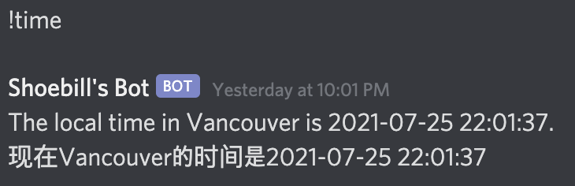

# shoebillbot
## A discord server bot
### Author: Mitchie Zhao (@shoebillm)

## Invite Shoebillbot to your server
[Shoebillbot Discord](https://discordapp.com/oauth2/authorize?&client_id=836236161801388083&scope=bot)


## Functions 

### Autoreply

When clients send certain keywords, the bot will randomly autoreply with pre-defined sentences. The keywords and sentences can be customized.

### Crypto Currency Price

Input `!crypto <currency abbreviation> <amount>` in the discord server chat channel, and the bot will return the current total price of the input crypto currency and the change.


### Stock Price & Trend

Input `!stock <stock abbreviation> <date>` in the discord server chat channel, and the bot will return the current price of the input stock and the trend line graph for the input date.


### Time Conversion

Input `!time <city name>` in the discord server chat channel, and the bot will return the current time of the input major city.




### Meme Searching

Input `!meme <meme keywords>` in the discord server chat channel, and the bot will return the top meme result from www.tenor.com.


### YouTube Video Searching

Input `!video <video keywords>` in the discord server chat channel, and the bot will return the top video result from www.youtube.com.


### Welcome Message

Upon the joining of any new members, the bot will send a direct welcome message to the client and the message content can be customized.


## Installation
### Clone Repository from GitHub

`git clone https://github.com/shoebillm/shoebillbot.git`

### Build Virtual Conda Envrionemtn and Dependencies

```
conda env create -f shoebillbot.yml
conda activate shoebillbot
```
## Usage

The shoebillbot can be invited to your discord server directly via [shoebillbot discord page](https://discord.com/oauth2/authorize?client_id=836236161801388083&scope=bot)

## Contributors
Mitchie Zhao @shoebillm
